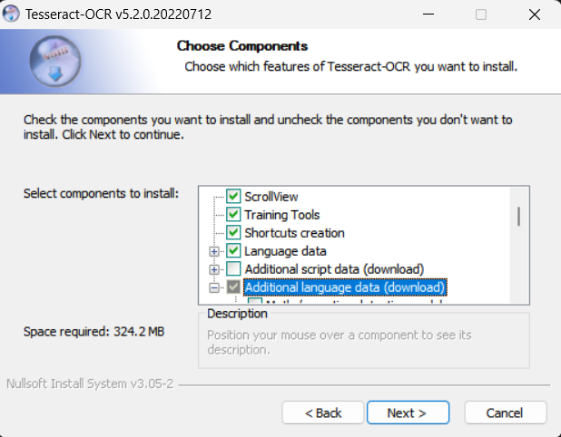
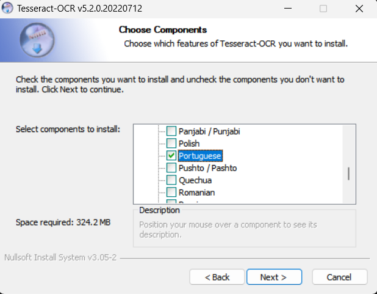

ClipBarcode
===============

O **ClipBarcode** é um projeto open source que tem como objetivo oferecer praticidade na leitura de códigos de barras e obtenção da linha digitável. Com o **ClipBarcode**, os usuários podem capturar uma imagem de um código de barras usando um print screen e o programa realizará a leitura do código de barras, fornecendo a linha digitável pronta para copiar e colar.

## Recursos Principais
O **ClipBarcode** oferece os seguintes recursos principais:
- **Leitura de Código de Barras**: Com o **ClipBarcode**, os usuários podem facilmente capturar códigos de barras presentes em boletos de cobrança, guias de impostos, convênios, QR Codes e Notas Fiscais. Basta utilizar o print screen para capturar a imagem e o programa realizará a leitura do código de barras automaticamente. O resultado será a linha digitável pronta para ser utilizada em pagamentos ou outras finalidades.
- **Leitura da Linha Digitável**: Se o código de barras estiver danificado ou for muito pequeno para ser capturado com precisão, o usuário tem a opção de fazer um print diretamente da linha digitável. O **ClipBarcode** será capaz de ler a imagem e extrair os dados necessários. Essa opção oferece flexibilidade em casos onde o código de barras não é legível, garantindo a obtenção da linha digitável de forma confiável.

Com esses recursos, o **ClipBarcode** simplifica o processo de leitura de códigos de barras e linha digitável, permitindo que os usuários realizem pagamentos e preenchimento de dados com facilidade e agilidade.

## Instalação

Para instalar o **ClipBarcode**, siga as etapas abaixo:

1. Baixe o arquivo de Instalação: [**clipbarcode_v1.6.0_win64.exe**](https://github.com/viniciusccosta/ClipBarcode/releases/download/v1.6.0/clipbarcode_v1.6.0_win64.exe)
2. Execute o instalador como Administrador e siga as instruções fornecidas.
3. Se você já possui o Tesseract OCR v5.2.0 e/ou o Microsoft Visual C++ v12.0.40664 instalados em seu sistema, você pode simplesmente cancelar a instalação desses componentes durante o processo de instalação do ClipBarcode.
4. Durante a instalação do Tesseract, certifique-se de selecionar "Portuguese" dentre as opções de "Additional language data (download)":

      
      

## Como Usar

1. Capture uma imagem do código de barras ou da linha digitável:
    - Utilize o comando `Windows + Shift + S` para selecionar apenas a área desejada da tela.
    - Se preferir, configure a tecla `PrintScreen` para capturar a tela.
        - No Windows 11, acesse Configurações > Acessibilidade > Teclado > Usar o botão PrintScreen para abrir a captura de tela.
    - Verifique se o print contém apenas um código de barras.
    - Ajuste o zoom para obter o código de barras no maior tamanho possível.
2. Abra o **ClipBarcode**.
    - Execute o programa **ClipBarcode** no seu computador.
3. Realize a leitura da imagem:
    - A leitura da imagem será realizada automaticamente assim que o **ClipBarcode** for aberto.
    - Caso o programa já esteja aberto, clique no botão "Ler Print" para iniciar a leitura da imagem capturada.
4. Aguarde o processamento e a leitura do código de barras:
    - Aguarde alguns instantes enquanto o **ClipBarcode** processa a imagem e realiza a leitura do código de barras.
5. Visualize a linha digitável:
    - O **ClipBarcode** exibirá a linha digitável obtida na interface do programa.
    - Copie e cole a linha digitável conforme necessário para realizar pagamentos ou outras finalidades.
6. Navegue entre os registros:
    - Utilize as setas do teclado (cima e baixo) para transitar entre os registros salvos na lista de leituras.
7. Exclua um registro:
    - Utilize a tecla "Delete" para remover um registro específico da lista de leituras.

## Instruções Adicionais

Aqui estão algumas informações adicionais sobre o **ClipBarcode**:

- **Histórico de Leituras**: O programa salvará todas as capturas de tela localmente no seu computador e fornecerá um histórico para acessar suas leituras anteriores. Isso permite que você tenha acesso fácil às suas capturas anteriores de uma forma conveniente.
- **Contorno Vermelho**: Um contorno vermelho será adicionado ao redor do código de barras lido, facilitando a identificação visual da captura correta da imagem fornecida pelo usuário.
- **Tipo de Leitura**: O programa exibirá na tela o tipo de leitura realizada, identificando se é um QR Code, Boleto, Nota Fiscal ou simplesmente Texto. Isso oferece uma visão clara do tipo de dado que foi extraído da imagem.
- **Campo de Descrição**: O programa oferece um campo de texto livre para adicionar uma descrição personalizada a cada leitura, facilitando a identificação dos registros.

Essas informações adicionais fornecem uma visão mais detalhada sobre o funcionamento do **ClipBarcode** e seus recursos, permitindo uma utilização mais completa e eficiente do programa.

## Troubleshooting

Se você encontrar algum problema ao utilizar o **ClipBarcode**, aqui estão algumas soluções comuns para ajudar a resolver possíveis dificuldades:
- **Não realizou a leitura do código de barras**: Caso o programa não consiga ler o código de barras corretamente, tente aumentar o zoom na imagem antes de capturá-la. Ampliar o tamanho do código de barras na imagem pode melhorar a precisão da leitura.

## Possíveis Atualizações

Abaixo estão algumas possíveis atualizações que podem ser implementadas no futuro:
- **Atualização Automática**: Implementar um sistema de atualização automática para garantir que os usuários sempre tenham acesso às últimas melhorias e correções de bugs. O programa fará o download e instalará automaticamente as atualizações disponíveis, proporcionando uma experiência contínua e atualizada.
- **Leitura Automática**: Adicionar a funcionalidade de leitura automática caso o **ClipBarcode** já esteja aberto. Isso permitirá que os usuários capturem uma imagem do código de barras ou linha digitável e a leitura seja realizada automaticamente, sem a necessidade de clicar no botão "Ler Print".

Essas são apenas algumas sugestões de possíveis atualizações. O projeto está aberto a contribuições da comunidade, e novas ideias e recursos podem ser adicionados no futuro para melhorar ainda mais a funcionalidade e usabilidade do **ClipBarcode**.

## Contribuição

O **ClipBarcode** é um projeto open source e recebe contribuições da comunidade. Caso você queira contribuir, siga os passos abaixo:
- Faça um fork do repositório do **ClipBarcode**.
- Implemente as alterações desejadas ou corrija bugs.
- Faça um pull request para enviar suas alterações.
- Aguarde a análise e a revisão da sua contribuição pela equipe responsável.

## Licença

O **ClipBarcode** é distribuído sob a licença MIT. Para mais detalhes, consulte o arquivo LICENSE.
